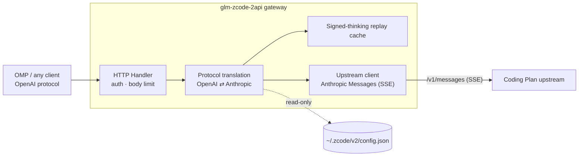

<p align="center">
  
</p>

<h1 align="center">glm-zcode-2api</h1>

<p align="center">
  <strong>A local reverse proxy that turns your ZCode plan into an OpenAI-compatible API</strong><br>
  Zero credential copying · LAN sharing · plan perks included
</p>

<p align="center">
  <a href="LICENSE"></a>
  <a href="https://go.dev"></a>
  
  <a href="#contributing"></a>
</p>

<p align="center">
  <a href="README.zh-CN.md">简体中文</a> | <strong>English</strong> | <a href="https://binggao1230.github.io/glm-zcode-2api/">Project site</a>
</p>

---

## For AI agents: one paragraph to set it all up

Paste the quoted paragraph below, verbatim, into any AI coding agent (OMP / Claude Code / Cursor etc.) — it will build and start the gateway, verify health, wire it into OMP, and report as it goes, with no manual commands from you:

> Read https://github.com/binggao1230/glm-zcode-2api/blob/main/AI_SETUP.md — it is the install & configuration doc for glm-zcode-2api, a gateway that turns a local ZCode plan into an OpenAI-compatible API. Follow it exactly: clone and build the project, start the gateway, verify its health, integrate it into OMP (oh-my-pi), then verify with `omp models zcode` and `omp --model zcode/glm-5.3-flash`, reporting each step's result along the way. Never commit or print real credentials.

You can also install it as a skill: copy [`skills/glm-zcode-2api-setup/`](skills/glm-zcode-2api-setup/SKILL.md) into your agent's skills directory (e.g. `~/.claude/skills/` for Claude Code), then just say "set up the ZCode gateway with glm-zcode-2api-setup".

## Usage

### Install & run

Requirements: the ZCode desktop app signed in locally; Go ≥ 1.22 (to build); Python 3 (launcher only).

```bash
git clone https://github.com/binggao1230/glm-zcode-2api
cd glm-zcode-2api

CGO_ENABLED=0 go build -trimpath -ldflags="-s -w" -o bin/glm-zcode-2api ./cmd/server

# reads the ZCode config, mints the access token, daemonizes
python3 scripts/omp-gateway.py start

curl -s http://127.0.0.1:7864/healthz
# {"service":"glm-zcode-2api","healthy":true,...}
```

### Verify

```bash
KEY=$(python3 scripts/omp-gateway.py token)

curl -sN http://127.0.0.1:7864/v1/chat/completions \
  -H "Authorization: Bearer $KEY" -H 'Content-Type: application/json' \
  -d '{"model":"<a model from your plan>","messages":[{"role":"user","content":"hi"}],"stream":true}'
```

### Management commands

```bash
python3 scripts/omp-gateway.py status    # runtime status + health
python3 scripts/omp-gateway.py restart   # after re-logging into ZCode / switching plans
python3 scripts/omp-gateway.py stop
python3 scripts/omp-gateway.py token     # print the access token
python3 scripts/omp-gateway.py usage     # live plan meter (5h window / weekly / today by hour)
```

### OMP (oh-my-pi) integration

`~/.omp/agent/models.yml`:

```yaml
  zcode:
    baseUrl: http://127.0.0.1:7864/v1
    api: openai-completions
    apiKey: '!/usr/bin/python3 ~/projects/glm-zcode-2api/scripts/omp-gateway.py token'
    authHeader: true
    compat:
      supportsStore: false
      supportsDeveloperRole: false
      maxTokensField: max_tokens
    models:
    # list the models your plan actually provides, as needed
    - id: glm-5.3
      name: ZCode / GLM-5.3
      reasoning: true
      input: [text]
      contextWindow: 1000000
      maxTokens: 128000
```

`apiKey` points at a **token-printing command**, not a fixed secret: when OMP resolves this provider and the gateway is not running, it is started automatically (≤2s) — no daemon to babysit. Then:

```bash
omp --model zcode/glm-5.3
omp models zcode
```

## About

This gateway wraps the Anthropic endpoint of your local ZCode plan (GLM Coding Plan / Z.ai Coding Plan) into an OpenAI-compatible API for any OpenAI client. Three design principles:

- **Zero credential copying**: the apiKey is read from the local ZCode config (`~/.zcode/v2/config.json`) — no copies, no app-file rewrites; re-logins and plan switches are followed automatically. No key lands in the repo or the OMP config.
- **Faithful protocol & behavior**: streaming / non-streaming, tool calls, thinking pass-through (including signed thinking-block replay so tool loops keep working), and thinking effort (`reasoning_effort` → `output_config.effort`) are all mapped one-to-one.
- **Same treatment as the app**: an optional mimic mode sends the app's attribution headers and account ID as-is, so off-peak 50% credit discounts and plan perks apply to proxied traffic equally (see [Off-peak discounts & request attribution](#off-peak-discounts--request-attribution)).

Listens on `0.0.0.0:7864` by default (LAN-accessible) with a mandatory access token. This is not a multi-tenant platform: no account pooling, no admin UI, and nothing that bypasses billing or plan limits.

## Core capabilities

| Capability | Notes |
|---|---|
| **OpenAI-compatible** | `/v1/chat/completions`, `/v1/models`; streaming SSE and aggregated non-streaming, drop-in for any OpenAI SDK/CLI |
| **Signed thinking replay** | Tool loops automatically get the `signature`-bearing thinking block re-injected — the gateway remembers signatures in an in-memory LRU |
| **Thinking effort pass-through** | `reasoning_effort` → `output_config.effort` (low / medium / high / max), `off` disables explicitly |
| **Client attribution (mimic)** | Mirrors the ZCode attribution headers and account ID, so off-peak 50% credit discounts apply equally |
| **Zero credential copying** | Reads the apiKey from the ZCode config read-only; follows re-logins and plan switches automatically |
| **LAN sharing** | `0.0.0.0` listener with a mandatory access token, one-command rotation |
| **On-demand startup** | OMP starts the gateway when resolving credentials (≤2s) — no daemon to babysit |
| **Honest errors** | Upstream 429 / 401 / 400 map to OpenAI errors as-is; mid-stream errors are never disguised as success |
| **Single binary** | Pure Go standard library, zero third-party dependencies, macOS / Linux / Windows |

## Architecture



Request side: system / developer messages become the top-level `system`; `tool` messages merge into one user turn as `tool_result` blocks; `tool_calls` → `tool_use`; `tool_choice` → `auto` / `any` / `tool`; thinking is enabled by default with `output_config.effort`; the system prompt gets prompt-cache breakpoints.

Response side: thinking deltas → `reasoning_content`; `tool_use` + `input_json_delta` → `tool_calls`; `stop_reason` maps to `stop` / `length` / `tool_calls`; usage includes cache hits (`prompt_tokens_details.cached_tokens`).

**Signed thinking replay**: the upstream requires the signed thinking block to be replayed verbatim inside tool loops, while OpenAI clients only echo visible text — the gateway caches signatures in an in-memory LRU keyed by "visible text + tool calls" (plus tool-call-id and reasoning-text indexes) and re-injects them on the next turn, invisible to the client.

## Off-peak discounts & request attribution

The new GLM Coding Plan is credit-based: **calls during off-peak hours (including all weekend) consume only 50% of standard credits** ([official docs](https://docs.bigmodel.cn/cn/guide/models/vlm/glm-5.3-flash)). These perks are decided by **client attribution**: the ZCode app attaches a full set of identity headers to model requests; bare third-party requests are billed as ordinary usage.

Two layers make proxied traffic look like the client's:

**1. The same endpoint.** Official coding-plan traffic never hits the provider directly — the client rewrites it onto the ZCode platform gateway, where plan entitlements are validated (`apps/zcode-cli/.../official-coding-plan-gateway.ts` in the official repo):

```
https://open.bigmodel.cn/api/anthropic/v1/messages → https://zcode.z.ai/api/v1/ultra/anthropic/v1/messages
https://api.z.ai/api/anthropic/v1/messages         → https://zcode.z.ai/api/v1/ultra-zai/anthropic/v1/messages
```

The gateway applies the same rewrite (`upstream.gateway_origin`, default `https://zcode.z.ai`; set it empty to talk to the provider directly).

**2. The same request shape.** `upstream.mimic_client` (enabled by the launcher by default) sends the app's own attribution material:

```
user-agent: ZCode/<app version>     http-referer: https://zcode.z.ai
x-zcode-agent: glm                  x-zcode-app-version / x-title / x-release-channel
x-platform: darwin-arm64            x-os-category / x-os-version (kernel release)
x-client-language / x-client-timezone (host IANA zone by default, override with upstream.client_timezone)
x-device-mid: <persistent per-install id>
x-request-id / x-zcode-trace-id / x-query-id / x-session-id (per request; session id stays stable per run)
metadata.user_id: {"device_id":"<id>","account_uuid":"","session_id":"<id>"}
```

`app_version` is read from `ZCode.app/Contents/Info.plist`, the device id is generated once and persisted in `~/.local/state/glm-zcode-2api/device.key`. With mimic off, the gateway calls upstream with only `x-api-key`, identifying as itself.

Measured window: `python3 scripts/omp-gateway.py usage` reads the official credit meter directly (5-hour window + weekly window) and shows the off-peak state (Beijing time 23:00-next day 09:00). Live measurement note: traffic inside the window still accrues credits (the official doc describes a 50% off-peak discount, not free usage); judge the discount by the usage page numbers.

## LAN access

The gateway listens on `0.0.0.0:7864` by default:

```bash
KEY=$(python3 ~/projects/glm-zcode-2api/scripts/omp-gateway.py token)   # on the host

curl -s http://192.168.x.x:7864/healthz                                  # from a LAN device (example IP)
curl -s http://192.168.x.x:7864/v1/models -H "Authorization: Bearer $KEY"
```

- Only `/healthz` is unauthenticated (for probes); `/v1/*` and `/status` require the token;
- The token equals usage rights to your plan: if leaked, `rm ~/.local/state/glm-zcode-2api/client.key && python3 scripts/omp-gateway.py restart` rotates it, clients need no changes;
- macOS may prompt to allow incoming connections the first time a LAN device connects.

## Configuration

`config.example.json` is the full reference; the runtime config is written by the launcher to `~/.local/state/glm-zcode-2api/config.json`.

| Field | Default | Notes |
|---|---|---|
| `listen` | `0.0.0.0:7864` | `0.0.0.0` = LAN-accessible (current default), `127.0.0.1:7864` = localhost only |
| `api_key` | generated by launcher | Client access token; empty = no auth |
| `server.max_body_mb` | `16` | Request body limit, over-limit returns 413 |
| `upstream.provider_id` | `builtin:bigmodel-coding-plan` | Which provider entry in the ZCode config to use |
| `upstream.credential_config_path` | `~/.zcode/v2/config.json` | Path to the ZCode config |
| `upstream.base_url` / `api_key` | empty | Overrides the values read from ZCode |
| `upstream.gateway_origin` | `https://zcode.z.ai` | Platform gateway that official coding-plan traffic goes through; empty = provider endpoint directly |
| `upstream.mimic_client` | `true` via launcher | Send ZCode attribution headers (see above); `false` in code |
| `upstream.app_version` | read from the app | `ZCode/<version>` in attribution headers |
| `upstream.device_id` | generated, persisted | `x-device-mid` and `metadata.user_id.device_id` |
| `upstream.client_timezone` | empty = detect host | IANA zone for `x-client-timezone`, override with `Z2A_CLIENT_TIMEZONE` |
| `upstream.header_timeout_seconds` | `120` | Wait for upstream response headers |
| `upstream.idle_timeout_seconds` | `300` | Idle limit inside a stream (silent stall) |
| `thinking.enabled` | `true` | Send `thinking.type=enabled` by default |
| `thinking.effort` | `max` | Default effort `low` \| `medium` \| `high` \| `max` (matches ZCode) |
| `thinking.prompt_cache` | `true` | Prompt-cache breakpoints on the system prompt |
| `models[].id` / `.upstream` | — | Client-facing model name / upstream model name |

**The client overrides the config for thinking**: a request carrying `reasoning_effort` (OMP's `--thinking` uses this field) or `reasoning.effort` wins; `minimal`→`low`, `xhigh`→`max`; `off`/`none`/`disabled` or `thinking.type=disabled` turns thinking off. Unset → table defaults.

Environment overrides (only non-empty values apply): `Z2A_LISTEN`, `Z2A_API_KEY`, `Z2A_UPSTREAM_BASE_URL`, `Z2A_UPSTREAM_PROVIDER_ID`, `Z2A_UPSTREAM_API_KEY`, `Z2A_CREDENTIAL_CONFIG_PATH`, `Z2A_CLIENT_TIMEZONE`, `Z2A_GATEWAY_ORIGIN`, `Z2A_DEVICE_ID`, `Z2A_USER_AGENT`, `Z2A_MAX_BODY_MB`, `Z2A_THINKING_ENABLED`, `Z2A_THINKING_EFFORT`, `Z2A_IDLE_TIMEOUT_SECONDS`. The launcher filters these out so the environment can't silently change the upstream destination.

## Error handling

| Upstream | Gateway | Notes |
|---|---|---|
| 401 / 403 | 401 / 403 | Key invalid: sign into ZCode again, then `restart` |
| 400 `invalid_request_error` | 400 | Passed through verbatim (incl. "model not found" `1211`) |
| 429 `rate_limit_error` `1310` | 429 | Plan quota exhausted; the reset-time message is preserved verbatim |
| ≥500 / network failure | 502 | Upstream unavailable |
| In-stream `error` event | SSE `{"error":…}` + `[DONE]` | An already-open stream is never disguised as a clean success |

## Project structure

```
glm-zcode-2api/
├── cmd/server/             # entrypoint: -config <file>
├── internal/config/        # config loading + Z2A_* env overrides
├── internal/credential/    # read-only ZCode config → apiKey/baseURL (cached, re-read on change)
├── internal/openai/        # outbound OpenAI wire types
├── internal/anthropic/     # upstream Anthropic wire types
├── internal/convert/       # request/response/SSE translation + signed-thinking replay
├── internal/upstream/      # upstream HTTP client (SSE parsing, idle watchdog, error classes)
├── internal/server/        # HTTP routes, auth, logging
├── scripts/omp-gateway.py  # OMP launcher: start/stop/status/restart/token
├── docs/                   # project site (GitHub Pages)
└── bin/                    # build output (git-ignored)
```

## Roadmap

- [ ] Automated releases (goreleaser, multi-platform binaries)
- [ ] Docker image (mounted credential directory)
- [ ] End-to-end image-input verification
- [ ] `zcode.z.ai` ZCode-plan endpoint support (requires `Authorization: Bearer` auth)
- [ ] Homebrew tap

## Contributing

Issues and PRs welcome:

- Pure Go standard library, single binary — **no third-party dependencies**;
- Run `gofmt -w . && go vet ./... && go test ./...` before submitting;
- **Never commit real credentials** (keys, JWTs, account IDs, client.key).

## License

[MIT](LICENSE)

## Acknowledgements

- [Sliverkiss/workbuddy2api](https://github.com/Sliverkiss/workbuddy2api) — the pioneer of this gateway pattern (CodeBuddy)
- [Z.ai / Zhipu GLM](https://z.ai) — GLM Coding Plan and the GLM family
- [can1357/oh-my-pi](https://github.com/can1357/oh-my-pi) — OMP and its custom provider mechanism
