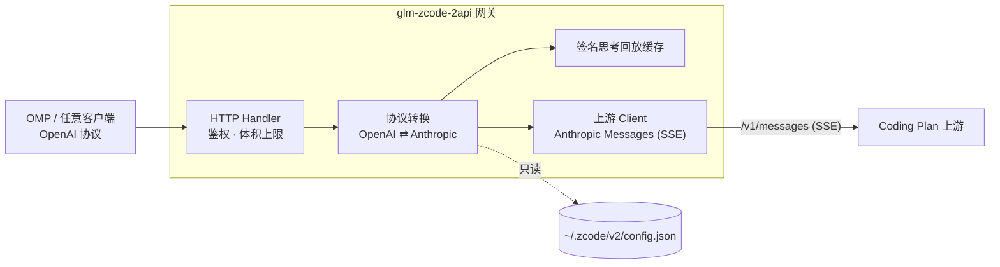

<p align="center">
  
</p>

<h1 align="center">glm-zcode-2api</h1>

<p align="center">
  <strong>把 ZCode 订阅变成 OpenAI 兼容 API 的本机反向代理</strong><br>
  凭据零搬运 · 局域网共享 · 闲时权益同权
</p>

<p align="center">
  <a href="LICENSE"></a>
  <a href="https://go.dev"></a>
  
  <a href="#contributing"></a>
</p>

<p align="center">
  <strong>简体中文</strong> | <a href="README.md">English</a> | <a href="https://binggao1230.github.io/glm-zcode-2api/">项目主页</a>
</p>

---

## 给 AI：一段话自动配置

把下面引用框里的这段话，原样发给任何 AI 编码代理（OMP / Claude Code / Cursor 等）——它就会自动完成安装、启动网关并接入 OMP，全程不需要你手动敲命令：

> 请阅读 https://github.com/binggao1230/glm-zcode-2api/blob/main/AI_SETUP.md —— 这是 glm-zcode-2api 的自动安装与配置文档，glm-zcode-2api 是一个把本机 ZCode 订阅变成 OpenAI 兼容 API 的网关。请严格按文档执行：克隆并构建项目、启动网关、验证健康状态、把它接入 OMP（oh-my-pi），最后用 `omp models zcode` 和 `omp --model zcode/glm-5.3-flash` 验收，并逐步报告每一步的结果。过程中不得提交或打印任何真实凭据。

也可以把它装成 skill：将 [`skills/glm-zcode-2api-setup/`](skills/glm-zcode-2api-setup/SKILL.md) 复制到你所用代理的 skills 目录（如 Claude Code 的 `~/.claude/skills/`），之后直接说「用 glm-zcode-2api-setup 帮我配置 ZCode 网关」。

## 使用

### 安装并启动

环境要求：本机已登录 ZCode 桌面版；Go ≥ 1.22（源码构建）；Python 3（仅启动器需要）。

```bash
git clone https://github.com/binggao1230/glm-zcode-2api
cd glm-zcode-2api

CGO_ENABLED=0 go build -trimpath -ldflags="-s -w" -o bin/glm-zcode-2api ./cmd/server

# 读取 ZCode 配置、生成访问口令、后台常驻
python3 scripts/omp-gateway.py start

curl -s http://127.0.0.1:7864/healthz
# {"service":"glm-zcode-2api","healthy":true,...}
```

### 验证

```bash
KEY=$(python3 scripts/omp-gateway.py token)

curl -sN http://127.0.0.1:7864/v1/chat/completions \
  -H "Authorization: Bearer $KEY" -H 'Content-Type: application/json' \
  -d '{"model":"<套餐内模型>","messages":[{"role":"user","content":"hi"}],"stream":true}'
```

### 管理命令

```bash
python3 scripts/omp-gateway.py status    # 运行状态 + health
python3 scripts/omp-gateway.py restart   # 重新登录 ZCode / 切换套餐后同步
python3 scripts/omp-gateway.py stop
python3 scripts/omp-gateway.py token     # 打印访问口令
python3 scripts/omp-gateway.py usage     # 实时套餐额度（5h 窗口 / 周窗口 / 今日分时）
```

### 接入 OMP（oh-my-pi）

`~/.omp/agent/models.yml`：

```yaml
  zcode:
    baseUrl: http://127.0.0.1:7864/v1
    api: openai-completions
    apiKey: '!/usr/bin/python3 ~/projects/glm-zcode-2api/scripts/omp-gateway.py token'
    authHeader: true
    compat:
      supportsStore: false
      supportsDeveloperRole: false
      maxTokensField: max_tokens
    models:
    # 模型以你当前套餐实际提供的为准，按需增删
    - id: glm-5.3
      name: ZCode / GLM-5.3
      reasoning: true
      input: [text]
      contextWindow: 1000000
      maxTokens: 128000
```

`apiKey` 指向的是**取口令命令**而非固定密钥：OMP 解析该 provider 时若网关未运行会自动拉起（≤2s），无需手工常驻。之后即可：

```bash
omp --model zcode/glm-5.3
omp models zcode
```

## 项目简介

本网关把本机 ZCode 订阅（GLM Coding Plan / Z.ai Coding Plan）的 Anthropic 端点包装成 OpenAI 兼容 API，供任意 OpenAI 客户端使用。设计上有三条主线：

- **凭据零搬运**：只读 ZCode 本机配置（`~/.zcode/v2/config.json`）取 apiKey，不复制、不改写 App 文件；ZCode 重新登录或切换套餐后自动跟随。密钥不落仓库、不进 OMP 配置。
- **协议与行为完整保留**：流式 / 非流式、工具调用、思考透传（含带签名的 thinking 块回放，保证工具循环不断）、思考档位（`reasoning_effort` → `output_config.effort`）一一映射。
- **与 App 同权**：可选 mimic 模式按 App 的实际取值发送归因头与账号 ID，闲时 50% 积分优惠等套餐权益对代理流量同等生效（详见[闲时优惠与请求归因](#闲时优惠与请求归因)）。

默认监听 `0.0.0.0:7864`（局域网可访问），访问口令强制。这不是多租户平台：没有账号池、没有后台界面，也不做任何绕过计费或限制的事。

## 核心能力

| 能力 | 说明 |
|---|---|
| **OpenAI 兼容** | `/v1/chat/completions`、`/v1/models`；流式 SSE 与非流式聚合双模式，任意 OpenAI SDK / CLI 零改造接入 |
| **签名思考回放** | 工具循环自动补回带 `signature` 的 thinking 块——OpenAI 客户端只回显可见文本，网关在内存 LRU 中记住签名并自动补回 |
| **思考档位透传** | `reasoning_effort` → `output_config.effort`（low / medium / high / max），`off` 显式关闭 |
| **客户端归因（mimic）** | 完整镜像 ZCode 归因头与账号 ID，闲时 50% 积分优惠与套餐权益同等生效 |
| **凭据零搬运** | 只读 ZCode 配置取 apiKey，App 重新登录 / 切换套餐后自动跟随（按文件变更重读） |
| **局域网共享** | `0.0.0.0` 监听 + 访问口令强制，口令一键轮换 |
| **按需启动** | OMP 解析凭据时自动拉起网关（≤2s），无需手工常驻 |
| **错误如实透传** | 上游 429 / 401 / 400 原样映射为 OpenAI 错误，流内错误不会被伪装成正常结束 |
| **单二进制** | 纯 Go 标准库、零第三方依赖，macOS / Linux / Windows |

## 架构总览



请求侧：system / developer 消息 → 顶层 `system`；`tool` 消息合并进同一条 user 消息的 `tool_result`；`tool_calls` → `tool_use`；`tool_choice` → `auto` / `any` / `tool`；思考默认开启并附带 `output_config.effort`；system 打 prompt cache 断点。

响应侧：thinking 增量 → `reasoning_content`；`tool_use` + `input_json_delta` → `tool_calls`；`stop_reason` 映射 `stop` / `length` / `tool_calls`；usage 含缓存命中（`prompt_tokens_details.cached_tokens`）。

**签名思考回放**：上游要求工具循环中把带 `signature` 的 thinking 块原样回传，而 OpenAI 客户端只会回显可见文本——网关用「可见文本 + 工具调用」指纹（辅以 tool_call id 与推理文本两个索引）在内存 LRU 中缓存签名，下一轮自动补回，客户端无需感知。

## 闲时优惠与请求归因

新版 GLM Coding Plan 按积分计费，**非高峰时段（含周末全天）的调用只消耗 50% 标准积分**（[官方说明](https://docs.bigmodel.cn/cn/guide/models/vlm/glm-5.3-flash)）。这类权益按**客户端归因**判定：ZCode App 在模型请求上携带一整套标识头，裸的第三方请求没有这套身份，服务端按普通调用记账。

两层都对齐才算「同权」：

**一、同一个端点。** 官方 Coding Plan 流量并不直连模型服务——客户端会把它重写到 ZCode 平台网关，由平台完成套餐权益校验（官方仓库 `apps/zcode-cli/.../official-coding-plan-gateway.ts`）：

```
https://open.bigmodel.cn/api/anthropic/v1/messages → https://zcode.z.ai/api/v1/ultra/anthropic/v1/messages
https://api.z.ai/api/anthropic/v1/messages         → https://zcode.z.ai/api/v1/ultra-zai/anthropic/v1/messages
```

网关做同样的重写（`upstream.gateway_origin`，默认 `https://zcode.z.ai`；置空则直连模型服务）。

**二、同样的请求形态。** `upstream.mimic_client`（启动器默认开启）按 App 的实际取值原样发出：

```
user-agent: ZCode/<App 版本>        http-referer: https://zcode.z.ai
x-zcode-agent: glm                  x-zcode-app-version / x-title / x-release-channel
x-platform: darwin-arm64            x-os-category / x-os-version（内核版本）
x-client-language / x-client-timezone（默认探测本机 IANA 时区，可用 upstream.client_timezone 指定）
x-device-mid: <持久化的设备 ID>
x-request-id / x-zcode-trace-id / x-query-id / x-session-id（每请求生成；会话 ID 单次运行内稳定）
metadata.user_id: {"device_id":"<设备 ID>","account_uuid":"","session_id":"<会话 ID>"}
```

`app_version` 从 `ZCode.app/Contents/Info.plist` 读取，设备 ID 首次生成后持久化在 `~/.local/state/glm-zcode-2api/device.key`。关闭 mimic 后网关只发 `x-api-key`，以自己的身份调用上游。

实测与观察窗口：`python3 scripts/omp-gateway.py usage` 直接读取官方积分表（5 小时窗口 + 周窗口），并标注闲时窗口状态（北京时间 23:00–次日 09:00）。**实测注意：窗口内流量仍会计入积分表**（官方文档口径为闲时 50% 折扣，并非免费）；是否打折以用量页数字为准。

## 局域网访问

网关默认监听 `0.0.0.0:7864`，同网段设备直接可用：

```bash
KEY=$(python3 ~/projects/glm-zcode-2api/scripts/omp-gateway.py token)   # 本机取口令

curl -s http://192.168.x.x:7864/healthz                                  # 局域网设备上（示例 IP）
curl -s http://192.168.x.x:7864/v1/models -H "Authorization: Bearer $KEY"
```

- 仅 `/healthz` 不鉴权（探活用）；`/v1/*` 与 `/status` 全部要求口令；
- 口令即账号额度使用权：泄漏后 `rm ~/.local/state/glm-zcode-2api/client.key && python3 scripts/omp-gateway.py restart` 自动轮换，客户端无需改配置；
- 首次从其他设备连接时，macOS 防火墙可能弹出「允许传入连接」，放行即可。

## 配置说明

`config.example.json` 是完整参考；实际运行配置由启动器写入 `~/.local/state/glm-zcode-2api/config.json`。

| 字段 | 默认 | 说明 |
|---|---|---|
| `listen` | `0.0.0.0:7864` | 监听地址：`0.0.0.0` = 局域网可访问（当前默认），`127.0.0.1:7864` = 仅本机 |
| `api_key` | 由启动器生成 | 客户端访问口令；空 = 不鉴权 |
| `server.max_body_mb` | `16` | 请求体上限，超限返回 413 |
| `upstream.provider_id` | `builtin:bigmodel-coding-plan` | 取 ZCode 配置里哪个 provider 的密钥 |
| `upstream.credential_config_path` | `~/.zcode/v2/config.json` | ZCode 配置路径 |
| `upstream.base_url` / `api_key` | 空 | 非空则覆盖从 ZCode 读到的值 |
| `upstream.gateway_origin` | `https://zcode.z.ai` | 官方 Coding Plan 流量经此平台网关（套餐权益校验处）；置空 = 直连模型服务 |
| `upstream.mimic_client` | 启动器写 `true` | 以 ZCode 客户端身份发送归因头（见上节）；代码默认 `false` |
| `upstream.app_version` | 读取 App 实际版本 | 归因头里的 `ZCode/<version>` |
| `upstream.device_id` | 生成后持久化 | `x-device-mid` 与 `metadata.user_id.device_id` |
| `upstream.client_timezone` | 空 = 按本机探测 | 归因头 `x-client-timezone` 用的 IANA 时区，可用 `Z2A_CLIENT_TIMEZONE` 覆盖 |
| `upstream.header_timeout_seconds` | `120` | 等上游响应头上限 |
| `upstream.idle_timeout_seconds` | `300` | 流中空闲上限（静默断流） |
| `thinking.enabled` | `true` | 默认是否发送 `thinking.type=enabled` |
| `thinking.effort` | `max` | 默认档位 `low` \| `medium` \| `high` \| `max`（对齐 ZCode 默认档） |
| `thinking.prompt_cache` | `true` | 给 system 打 prompt cache 断点 |
| `models[].id` / `.upstream` | — | 客户端模型名 / 上游模型名 |

**思考档位由客户端覆盖配置**：请求带 `reasoning_effort`（OMP 的 `--thinking` 即走此字段）或 `reasoning.effort` 时以客户端为准；`minimal`→`low`、`xhigh`→`max`，`off`/`none`/`disabled` 或 `thinking.type=disabled` 则关闭。未指定时用上表默认值。

环境变量覆盖（非空才生效）：`Z2A_LISTEN`、`Z2A_API_KEY`、`Z2A_UPSTREAM_BASE_URL`、`Z2A_UPSTREAM_PROVIDER_ID`、`Z2A_UPSTREAM_API_KEY`、`Z2A_CREDENTIAL_CONFIG_PATH`、`Z2A_CLIENT_TIMEZONE`、`Z2A_GATEWAY_ORIGIN`、`Z2A_DEVICE_ID`、`Z2A_USER_AGENT`、`Z2A_MAX_BODY_MB`、`Z2A_THINKING_ENABLED`、`Z2A_THINKING_EFFORT`、`Z2A_IDLE_TIMEOUT_SECONDS`。启动器会过滤掉这些变量，避免环境意外改变上游目的地。

## 错误处理

| 上游 | 网关 | 说明 |
|---|---|---|
| 401 / 403 | 401 / 403 | 密钥失效：在 ZCode 重新登录后 `restart` |
| 400 `invalid_request_error` | 400 | 原样透传（含「模型不存在」`1211` 等） |
| 429 `rate_limit_error` `1310` | 429 | 计划配额耗尽，原样保留重置时间文案 |
| ≥500 / 网络失败 | 502 | 上游不可用 |
| 流内 `error` 事件 | SSE `{"error":…}` + `[DONE]` | 已开始的流不会被伪装成正常结束 |

## 项目结构

```
glm-zcode-2api/
├── cmd/server/             # 入口：-config 指定配置
├── internal/config/        # 配置加载 + Z2A_* 环境覆盖
├── internal/credential/    # 只读 ZCode 配置，取 apiKey/baseURL（缓存 + 变更重读）
├── internal/openai/        # 对外 OpenAI 线格式
├── internal/anthropic/     # 上游 Anthropic 线格式
├── internal/convert/       # 请求/响应/SSE 转换 + 签名思考回放
├── internal/upstream/      # 上游 HTTP 客户端（SSE 解析、空闲看门狗、错误归类）
├── internal/server/        # HTTP 路由、鉴权、日志
├── scripts/omp-gateway.py  # OMP 启动器：start/stop/status/restart/token
├── docs/                   # 项目主页（GitHub Pages）
└── bin/                    # 构建产物（git 忽略）
```

## Roadmap

- [ ] Release 自动化（goreleaser 多平台二进制）
- [ ] Docker 镜像（凭据目录挂载）
- [ ] 图片输入端到端验证
- [ ] `zcode.z.ai` ZCode 自有套餐端点支持（需 `Authorization: Bearer` 鉴权方式）
- [ ] Homebrew tap

## Contributing

欢迎 Issue 与 PR：

- 纯 Go 标准库、单二进制——**不引入第三方依赖**；
- 提交前跑 `gofmt -w . && go vet ./... && go test ./...`；
- **严禁提交任何真实凭据**（key、JWT、账号 ID、client.key）。

## License

[MIT](LICENSE)

## 致谢

- [Sliverkiss/workbuddy2api](https://github.com/Sliverkiss/workbuddy2api) —— 同类思路（CodeBuddy 网关）的先行者
- [Z.ai / 智谱 GLM](https://z.ai) —— GLM Coding Plan 与 GLM 系列
- [can1357/oh-my-pi](https://github.com/can1357/oh-my-pi) —— OMP 及其自定义 provider 机制
